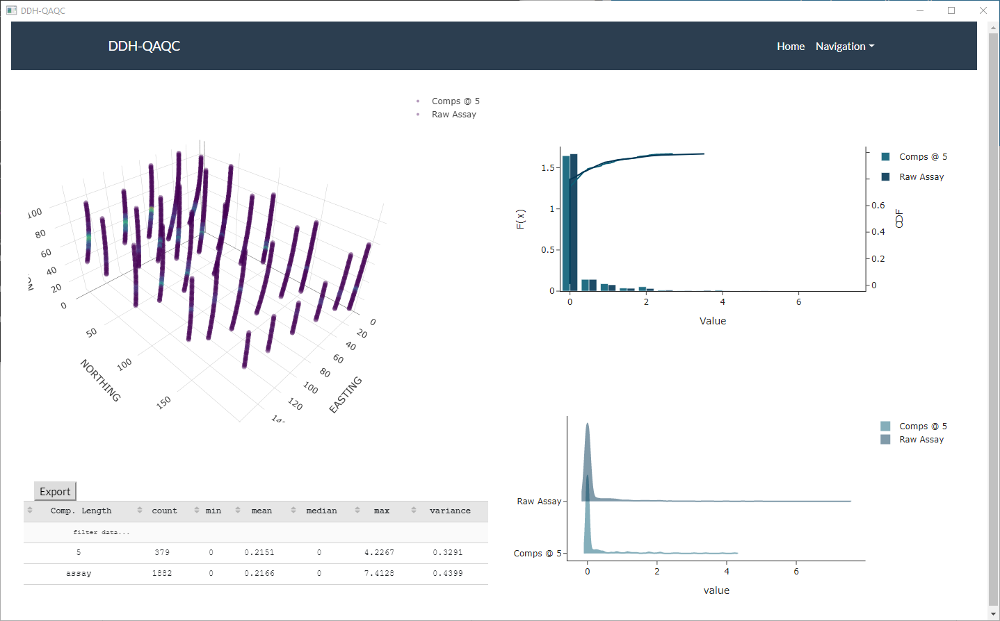

# Stand Alone Dash App: DDH-QAQC (POC)

This app was created largely as a proof-of-concept (POC) to satisfy my own curiosity.
My initial question was: Can I create a stand alone .exe dash app. The answer is yes!
and the end result is quite satisfying. The web-app has been converted to a stand alone application using [pyfladesk](https://github.com/smoqadam/PyFladesk) and then packaged with [pyinstaller](https://www.pyinstaller.org/).

## The App: DDH-QAQC

Diamond Drillhole Quality-Assurance Quality-Control (DDH-QAQC) is a small dash app designed to desurvey and composite mining drill hole data as well as provide some basic data visualization for QA/QC purposes. This is a work in progress and hasn't been optimized, as previously mentioned the main goal here was to try packing a dash app.

An example comparing 5m composites to the original assay intervals. A small sample dataset is included in `./data`.



Also, a thank you to Adrian Martinez Vargas , much of the composite code was adapted from his implementation shared on the [opengeostat github page](https://github.com/opengeostat).

## Packing the Dash App

1. PyFladesk - this part is easy. At the of `main.py` simply replace `app.run_server()`
   with `init_gui(app.server)`. The actual code used is below with a few additional options:

```
if __name__ == "__main__":
    from pyfladesk import init_gui

    init_gui(
        app.server,
        port=5000,
        width=1200,
        height=800,
        window_title="DDH-QAQC",
        icon="App/assets/favicon.ico",
        argv=None,
    )
```

2. Creating the EXE - this took a bit of trial and error. Pyinstaller was not automatically adding the necessary dash and plotly libraries to the output so they had to be included manually in the pyinstaller specfile (see `main_dir.spec` for more):

```
import os
import site

site_pkgs_dir = site.getsitepackages()[1]
addl_pkgs = ["plotly", "dash_renderer","dash_html_components","dash_bootstrap_components", "dash_core_components", "dash_table"]

a = Analysis(['main.py'],
             pathex=['c:\\code-dev\\ddh-qaqc\\App'],
             binaries=[],
             datas=[(os.path.join(site_pkgs_dir,pkg),pkg) for pkg in addl_pkgs],

```

Also, I ran into some trouble with `flask-compress`. See [this Stack Overflow question](https://stackoverflow.com/questions/64290390/pyinstaller-executable-cannot-find-flask-compress-distribution-that-is-include) for the solution.
This was copied to the `app.py` file prior to `import dash`.

## Conclusion

This is surely not the best way to make some standalone application, but it is a fun and maybe useful way to take a python based dash app and package it for use on another machine or by an individual who doesn't want to do the python setup etc.

## TODO:

There is plenty that can be done here, a few items on my mind are to speed up the desurvey and composite processes by reworking the code a bit and maybe including some numba or dask. Also, the stand alone .exe file doesn't seem to work (though it works fine from the directory output option of pyinstaller).
